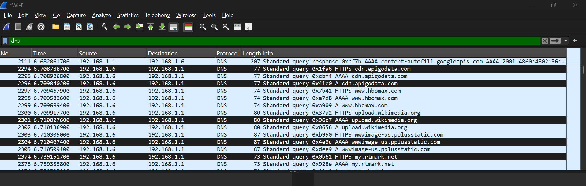
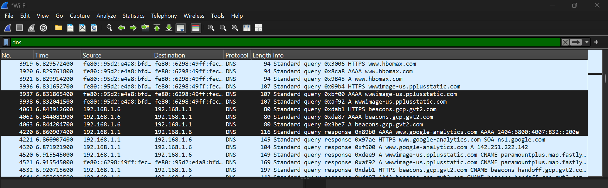
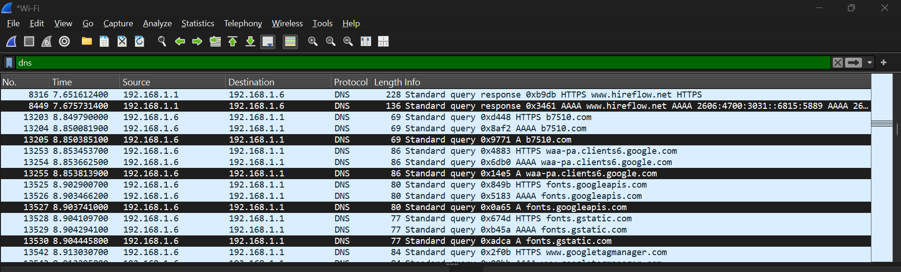

# Network Traffic Analysis using Wireshark

## 📌 Overview

In this project, I analyzed how network traffic behaves using Wireshark, with a focus on DNS activity.

The idea was simple — understand what “normal” traffic looks like, and then observe how things change when there is a sudden increase in activity.

---

## 🛠️ Setup

- Windows laptop (local system)
- Wireshark for capturing network traffic

---

## 🔍 What I Did

First, I captured normal browsing activity by visiting a few common websites like Google, YouTube, and LinkedIn.

Then, I simulated high activity by opening multiple websites quickly to generate a burst of DNS requests.

After capturing the traffic, I filtered it using `dns` and started analyzing patterns.

---

## 📊 What I Observed

### 🔹 Dense DNS Activity

At certain points, I noticed a large number of DNS requests happening very close together. The traffic looked tightly packed with almost no gaps between entries.

---

### 🔹 Rapid Requests

Looking closely at the timestamps, some DNS queries were happening within milliseconds of each other. This showed how quickly the system was making requests during high activity.

---

### 🔹 Multiple Domains

Instead of just a few websites, I saw requests going to multiple domains including Google services, Cloudflare, media platforms, and others.

---

## 🔎 Analysis

From this, I understood that:

- Normal browsing usually results in predictable and limited DNS activity
- When many requests happen quickly, the traffic becomes dense and fast
- Multiple domain requests can come from browsing, background services, or tracking systems

In a real SOC environment, such activity would require correlation with endpoint logs and validation of the source to determine whether the behavior is benign or potentially malicious.

Based on the observed traffic patterns and known domains, the activity appears consistent with normal browsing behavior. However, the presence of a few uncommon domains highlights the importance of validating domain reputation in real-world investigations.

---

## 🛡️ Why This Matters

This kind of analysis is important in a SOC environment because unusual DNS patterns can sometimes indicate automated behavior, tracking activity, or even suspicious communication.

---

## 🧠 What I Learned

- How DNS requests appear in real network traffic
- How to use Wireshark filters to analyze traffic
- How to identify patterns based on timing and volume
- The importance of comparing normal vs unusual behavior

---

## 🎯 Conclusion

This project helped me understand how systems communicate over the network and how simple patterns can reveal a lot about activity.

It also gave me a better idea of how analysts approach traffic investigation in real-world scenarios.

---

## ℹ️ Note

This project was performed in a controlled environment for learning purposes.
